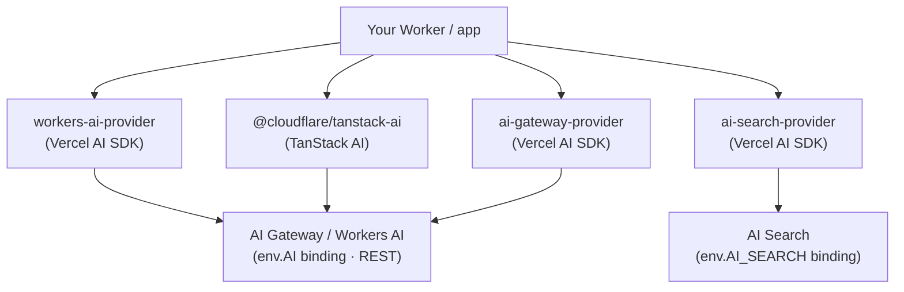

# Cloudflare AI — documentation

Guides and reference for the Cloudflare AI packages: providers and adapters for
the [Vercel AI SDK](https://sdk.vercel.ai/) and [TanStack AI](https://tanstack.com/ai),
backed by [Workers AI](https://ai.cloudflare.com/),
[AI Gateway](https://developers.cloudflare.com/ai-gateway/), and
[AI Search](https://developers.cloudflare.com/ai-search/).

## How the packages relate

These packages split by backend. `workers-ai-provider`, `@cloudflare/tanstack-ai`, and `ai-gateway-provider` all reach Workers AI / AI Gateway through the `env.AI` binding (or its REST API), so they share the same gateway routing, `cf-aig-*` header building, resumable-stream engine, and SSE handling. `ai-search-provider` targets the `env.AI_SEARCH` binding instead, so it's a standalone provider with its own request/response mapping.

## Pick a package

| You are using…                                   | Use                                                      | Docs                                                                                                                                          |
| ------------------------------------------------ | -------------------------------------------------------- | --------------------------------------------------------------------------------------------------------------------------------------------- |
| Vercel AI SDK (`ai`)                             | [`workers-ai-provider`](./workers-ai-provider/README.md) | Workers AI models + the AI Gateway **delegate** (unified catalog, resume _(coming soon)_, server-side fallback)                               |
| Vercel AI SDK (`ai`) + AI Search                 | [`ai-search-provider`](./ai-search-provider/README.md)   | Upload files to AI Search for indexing, then search with natural language or generate grounded chat responses |
| TanStack AI (`@tanstack/ai`)                     | [`@cloudflare/tanstack-ai`](./tanstack-ai/README.md)     | Workers AI + gateway adapters, with resumable streaming _(coming soon)_                                                                       |
| Gateway routing for pre-built `@ai-sdk/*` models | [`ai-gateway-provider`](./ai-gateway-provider/README.md) | Wrap Vercel AI SDK model instances and route them through AI Gateway (caching, retries, cross-vendor fallback)                                |

## Concepts

- [Gateway routing](./concepts/gateway-routing.md) — how a `vendor/model` slug
  is routed to the run path or the gateway path, unified vs BYOK billing, and
  server-side fallback.
- [Resumable streaming](./concepts/resume.md) _(coming soon)_ — how transient
  mid-stream drops reconnect transparently via `cf-aig-run-id`, and where resume
  is (and isn't) available.
- [Binding vs REST](./concepts/binding-vs-rest.md) — the `env.AI` binding versus
  the REST API, and what each transport supports.
